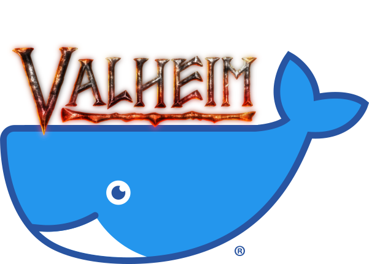

docker-valheim
==============

    

    
    
    
     
    
    
    
    

    Docker image for <a href="https://www.valheimgame.com">Valheim</a> dedicated server.

---

Running the Container
---------------------

First create a named data volume to hold the persistent world and config data:

    docker volume create --name valheim-data

Then run the Valheim server:

    docker run -it -d -p 2456-2458:2456-2458/udp -v valheim-data:/home/steam/.config/unity3d/IronGate/Valheim --name valheim-server phlak/valheim

#### Optional 'docker run' Arguments

ENV SERVER_NAME "My World"
ENV SERVER_PASSWORD "secret"
ENV SERVER_PORT 2456
ENV WORLD_NAME "Valhalla"

<dl>
    <dt><code>-e SERVER_NAME="My world"</code></dt>
    <dd>Set the name of your server. This will be the name that shows up in the community server browser.</dd>
</dl>

<dl>
    <dt><code>-e SERVER_PASSWORD=secret</code></dt>
    <dd>The server password.</dd>
</dl>

<dl>
    <dt><code>-e WORLD_NAME=Valhalla</code></dt>
    <dd>Set world name. This will be the name of the folder your world is saved in. Within the container you can find your worlds in the <code>/home/steam/.config/unity3d/IronGate/Valheim/worlds</code> folder</dd>
</dl>

<dl>
    <dt><code>-e TZ=America/Phoenix</code></dt>
    <dd>Set the timezone for your server. You can find your timezone in this <a href="https://goo.gl/uy1J6q">list of timezones</a>. Use the (case sensitive) value from the <code>TZ</code> column. If left unset, timezone will be UTC.</dd>
</dl>

<dl>
    <dt><code>--restart unless-stopped</code></dt>
    <dd>Always restart the container regardless of the exit status, but do not start it on daemon startup if the container has been put to a stopped state before. See the Docker <a href="https://goo.gl/Y0dlDH">restart policies</a> for additional details.</dd>
</dl>

Docker Compose
--------------

For quick and easy management via [Docker Compose](https://docs.docker.com/compose/) check out https://github.com/PHLAK/valheim-compose

Upgrading the Server
--------------------

First pull down the latest image:

    docker pull phlak/valheim

Remove your running server container:

    docker rm -f valheim-server

And run a new one with the same command/arguments as before.

Troubleshooting
---------------

For general help and support join our [GitHub Discussions](https://github.com/PHLAK/docker-valheim/discussions) or reach out on [Twitter](https://twitter.com/PHLAK).

Please report bugs to the [GitHub Issue Tracker](https://github.com/PHLAK/docker-valheim/issues).

Copyright
---------

This project is licensed under the [MIT License](https://github.com/PHLAK/docker-valheim/blob/master/LICENSE).

Valheim copyright by [Iron Gate Studios](https://www.irongatestudio.se).
